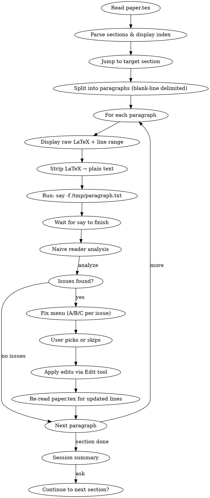

# Paper Read-Aloud

## Overview

Interactive paragraph-by-paragraph paper review using macOS text-to-speech. Reads each paragraph aloud via the `say` command, then analyzes it as a naive first-time reader. Issues are reported with 2-3 fix options; the user picks one (or skips), the edit is applied, and the skill advances to the next paragraph.

The core insight: *hearing* prose aloud exposes awkward phrasing, overloaded sentences, and logical gaps that silent reading misses. The forced stop after each paragraph prevents skimming.

## When to Use

- User says "read my paper aloud", "let me hear it", "read-aloud review"
- User invokes `/paper-read-aloud` or `/paper-read-aloud N`
- When the user wants to catch prose-level issues that structural review misses

## Invocation

```
/paper-read-aloud          # start at Section 1
/paper-read-aloud 3        # start at Section 3
```

## Workflow



## Setup

### Step 1: Read Paper

Read the full `paper.tex` file. Default path: `paper.tex` in the current directory.

### Step 2: Parse Section Structure

Extract all `\section{...}` and `\subsection{...}` headers with their line ranges. Display a numbered index:

```
Sections in paper.tex:
  1. Introduction (lines 45-120)
  2. Library Architecture (lines 121-210)
  3. Harness Design (lines 211-340)
  ...
```

### Step 3: Jump to Target

If the user provided a section number, start there. Otherwise start at Section 1.

### Step 4: Split Into Paragraphs

Split the target section's content by blank lines. Each blank-line-delimited block is one paragraph. Track the line number range for each paragraph.

Display: `"Reading Section N: <title> — X paragraphs. Starting..."`

## LaTeX-to-Speech Stripping

Before passing text to `say`, strip LaTeX to natural speech:

| LaTeX construct | Speech treatment |
|---|---|
| `\cite{...}` | Remove entirely |
| `\label{...}` | Remove entirely |
| `\ref{...}` | Say "figure reference" or "section reference" |
| `\eqref{...}` | Say "equation reference" |
| `\textbf{...}`, `\textit{...}`, `\emph{...}` | Keep inner text |
| `\texttt{...}` | Keep inner text |
| `$...$` inline math | Best-effort pronunciation (e.g., `$O(n^2)$` → "O of n squared") |
| `\begin{figure}...\end{figure}` | Skip block entirely |
| `\begin{table}...\end{table}` | Skip block entirely |
| `\begin{lstlisting}...\end{lstlisting}` | Skip, say "code listing skipped" |
| `\begin{equation}...\end{equation}` | Say "equation block" |
| `\begin{itemize}` / `\begin{enumerate}` items | Keep as plain text, strip `\item` |
| `\\`, `\newline` | Remove |
| `~` (non-breaking space) | Replace with space |
| `\%`, `\&`, `\_` | Replace with the literal character |

Write the stripped text to `/tmp/paragraph.txt` and run `say -f /tmp/paragraph.txt` to avoid shell quoting issues.

## The Read-Analyze-Fix Loop

For each paragraph:

### Step 1 — Display & Speak

1. Show the raw LaTeX paragraph in a blockquote, with line range (e.g., `lines 142-155`).
2. Write stripped plain text to `/tmp/paragraph.txt`.
3. Run `say -f /tmp/paragraph.txt` via Bash. Wait for it to finish.

### Step 2 — Naive Reader Analysis

Analyze the paragraph as if hearing it for the first time. Only consider text seen so far in this session. Check for:

- **Undefined terms** — jargon or acronyms used before being defined
- **Logical gaps** — conclusions that don't follow from what was stated
- **Unclear referents** — "this", "it", "these" pointing to ambiguous antecedents
- **Overloaded sentences** — sentences trying to do too much
- **Awkward phrasing** — things that sound wrong when read aloud
- **Redundancy** — saying the same thing twice in different words

If **no issues** found: print `"No issues. Moving to next paragraph."` and advance automatically.

### Step 3 — Fix Menu

For each issue found, use `AskUserQuestion`:

- **question**: State the problem in one sentence. Include the full original paragraph so the user can see context.
- **options**: 2-3 fix options labeled (a), (b), (c). Mark the recommended option with "(Recommended)". Always include "Skip — leave as is" as the last option.
- **preview**: Show the paragraph after each fix is applied so the user can compare.

After the user picks, apply the edit with the `Edit` tool.

After all issues in the paragraph are resolved, advance to the next paragraph.

## Navigation Commands

The user can type these at any prompt during the loop:

| Command | Effect |
|---|---|
| `next` or `n` | Skip this paragraph, no analysis |
| `stop` | End session immediately, show summary |
| `replay` | Re-read current paragraph aloud (before edits) |
| `re-read` | Re-read current paragraph aloud (after edits applied) |

When the user types a navigation command instead of picking a fix option, honor the command.

## Edge Cases

- **Figures/tables**: When a `\begin{figure}` or `\begin{table}` block is encountered as a paragraph, skip it but announce: `"[Figure: <caption text>] — skipped."`
- **Code listings**: Skip with `"[Code listing] — skipped."`
- **Very short paragraphs** (single sentence): Still read and analyze individually. Do not merge with neighbors.
- **Equation blocks**: Read surrounding context normally; say `"equation block"` for the math content itself.
- **Line number drift after edits**: After applying any fix, re-read `paper.tex` to get updated line numbers before processing the next paragraph. This ensures the Edit tool always targets correct text.
- **Long paragraphs**: Let `say` finish naturally. No splitting. The user can type `stop` to end the session.

## Session End

When `stop` is typed or all paragraphs in the section are done:

1. Print a summary:
   ```
   Session complete.
   - Paragraphs read: 12
   - Issues found: 5
   - Fixes applied: 3
   - Skipped: 2
   ```
2. If the section is complete, ask: `"Continue to next section?"`

## Scope Boundaries

This skill does NOT do:

- Overall structural review (use `paper-revision` for that)
- Bibliography or citation checking
- Figure/table content review
- Cross-section coherence analysis
- Subagent dispatch — this is a single-agent loop

## Common Mistakes

- Running `say "text with quotes"` directly — use `say -f /tmp/paragraph.txt` to avoid shell quoting issues
- Forgetting to re-read the file after applying edits — line numbers will be stale
- Analyzing with knowledge of later paragraphs — only consider text seen so far
- Presenting too many issues at once — present one issue at a time via `AskUserQuestion`
- Skipping the section index display — user needs to see what's available before starting
