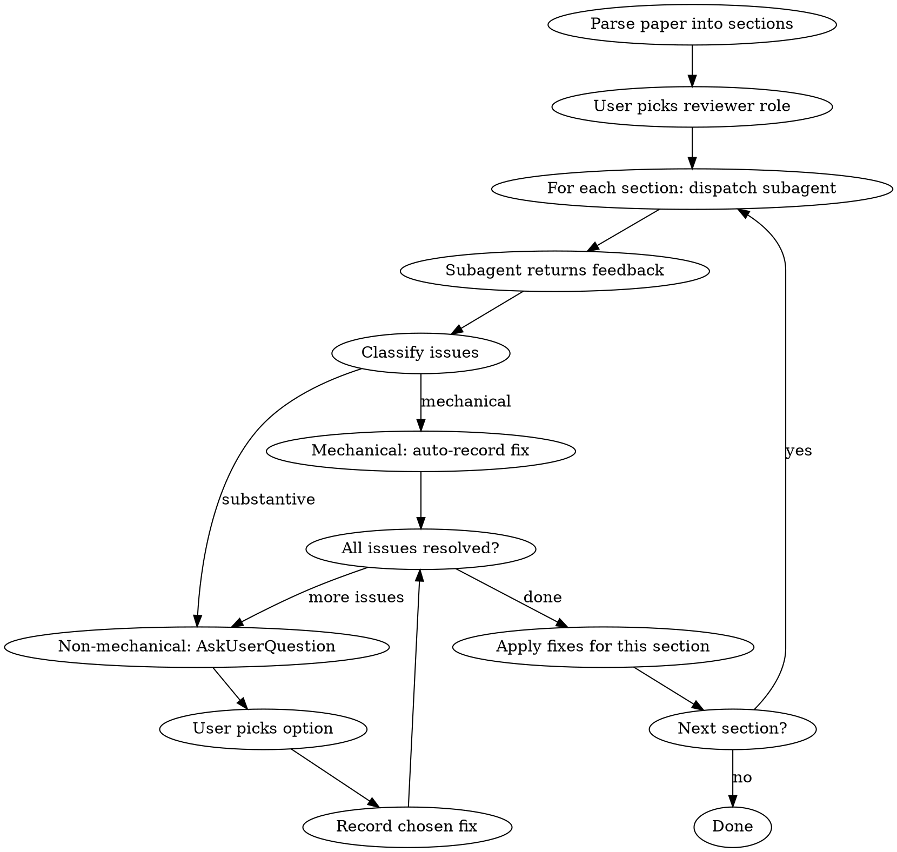

# Paper Writing Review

## Overview

Section-by-section writing review using a context-free subagent. The subagent reads ONLY the paper text (no CLAUDE.md, no project files), simulating a fresh reader. Issues are classified as mechanical (auto-fixed) or substantive (user chooses via interactive selection). Fixes are applied after each section before moving to the next.

## When to Use

- Self-reviewing a paper draft for writing quality
- User says "review my paper", "check my writing", "find wordy sections"
- Before submission, after content is stable

## Workflow



## Setup

### Step 1: Get Paper Path

Ask the user for the paper file path. Default: `paper.tex` in the current directory.

### Step 2: Parse Sections

Read the paper and split it by `\section{...}` (or `\section*{...}`). Each section includes everything from its `\section` command up to (but not including) the next `\section` or `\end{document}`. Also extract the preamble + abstract as a separate "section 0" for context.

Record the section list with line ranges. Present the list to the user and ask which sections to review (default: all).

### Step 3: Choose Reviewer Role

Ask the user:

> **Which reviewer role?**
> 1. **Naive reader** — Simulates someone reading the paper for the first time with no domain knowledge. Catches: undefined terms, unclear motivation, logical jumps, assumed context, confusing structure.
> 2. **Expert reviewer** — Domain expert who evaluates technical accuracy, argument strength, and scholarly rigor in addition to writing quality. Catches: everything above plus weak claims, missing justification, overclaiming, gaps in reasoning.

## Review Loop

For each selected section, dispatch a subagent with the following structure.

### Subagent Prompt Template

```
You are reviewing a section of an academic paper. You have NO prior context about
this project — you are reading the paper text for the first time.

ROLE: {naive_reader | expert_reviewer}

{If naive_reader:}
You simulate a reader encountering this paper fresh. Flag anything that would
confuse, bore, or lose a reader who has general technical literacy but no
specific background in this paper's domain.

{If expert_reviewer:}
You are a domain expert reviewer. In addition to writing quality, evaluate
technical accuracy, argument strength, and scholarly rigor.

CONTEXT FROM EARLIER SECTIONS (summary only):
{Brief summary of what was established in prior sections — key definitions,
main claims, notation introduced. Keep this minimal: just enough so the
reviewer knows what terms have been defined. Do NOT include project-level
context or instructions.}

SECTION TO REVIEW:
---
{Raw LaTeX text of this section}
---

Provide a structured list of issues. For each issue:
1. Quote the problematic text (verbatim, 1-2 sentences)
2. Issue type: one of [confused, wordy, digression, undefined-term,
   logical-jump, overclaiming, weak-justification, redundant, unclear-reference,
   other]
3. Explanation: Why this is a problem, from the reader's perspective
4. Severity: minor | moderate | major

Order issues by their appearance in the text.
Do NOT suggest fixes — only identify and explain problems.
If the section reads well, say so and note any minor polish opportunities.
```

### Processing Subagent Feedback

For each issue returned by the subagent:

**Mechanical issues** (auto-fix, no user input needed):
- Typos, grammar errors, obvious word repetition
- Dangling references, broken LaTeX commands
- Record the fix silently

**Non-mechanical issues** (present to user via `AskUserQuestion`):

Use `AskUserQuestion` with `multiSelect: false`, batching up to 4 issues per call. For each issue:
- **question**: MUST include: (1) the issue type and severity, (2) a brief explanation, and (3) the **entire original paragraph** containing the problematic text — not just the quoted snippet. The user needs the full paragraph to judge the issue in context.
- **preview**: Show the paragraph **after** each proposed fix is applied, so the user can compare before (in the question) vs after (in the preview).
- **options**: 2–4 options (the tool's limit). The user can always provide free-form input via the built-in "Other" option.
  - **Recommend one option**: Mark the best option with "(Recommended)" at the end of the label. Place it first in the list.
  - **"Search & think harder" option**: When the issue involves a claim that could be verified, a term that might have an established definition, or a reference that could be checked — include an option like "Search web for prior usage / standard phrasing" so the main agent can do research before proposing a fix.
  - Always include "Skip" as the last option.

Example `AskUserQuestion` option structure:
```json
{
  "label": "(a) Cut sentence (Recommended)",
  "description": "Remove the sentence entirely — the point is made elsewhere.",
  "preview": "The full original paragraph text here,\nwith the problematic sentence in context,\nso the user can judge the edit in situ."
}
```

### Section Transition

After all issues in a section are resolved, summarize what was decided and move to the next section. Update the "context from earlier sections" summary for the next subagent.

## Applying Fixes (per section)

After all issues in a section are resolved:

1. Present a summary of all recorded fixes for this section (mechanical + user-chosen)
2. Apply all edits in reverse line-number order (to preserve line numbers)
3. Rebuild the paper to verify no LaTeX errors were introduced
4. Move to the next section

## Key Rules

- **Subagent isolation**: The subagent must NOT read CLAUDE.md, project files, or any file other than the section text passed to it. It receives only the section text and a minimal summary of prior sections.
- **No unsolicited fixes**: The main agent does not add its own opinions. All feedback comes from the subagent; all decisions come from the user.
- **Apply per section**: Fixes are applied after each section's review is complete, before moving to the next section. This gives the user immediate feedback and keeps the review grounded.
- **Context accumulation**: Each subagent gets a growing summary of what prior sections established (definitions, notation, claims), but never the raw text of other sections.

## Common Mistakes

- Giving the subagent project context (CLAUDE.md, README) — defeats the purpose of fresh-reader simulation
- Proposing two options that are minor wording variants — options must represent different editorial strategies
- Showing only the quoted snippet without the full paragraph — user needs surrounding context to judge the edit
- Presenting issues as plain text instead of using `AskUserQuestion` — user cannot efficiently select options
- Skipping the "which sections to review" step — user may want to focus on specific sections
